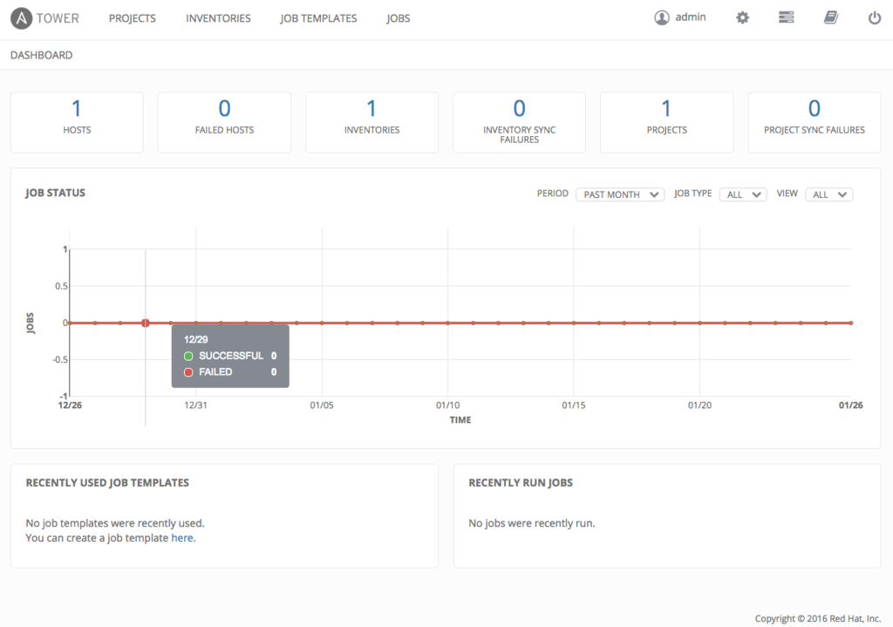

空気が暖かくなったり冷たくなったり、年々外気温に振り回される体質になってきてますね

会社は暖かいので、なにを着ていったらいいのか分からない感じですが、構成管理ってやってますでしょうか

最近、身の回りの環境が変わって、ChefとかCapistrano使ってるんだろうな〜って思われるなにかに触れる機会が多いのですが、以前はAnsibleで結構な台数のvmを管理してました

cookbookとか見たいなと思ってるのですが、これからAnsible触る機会少なそうだし、せっかく苦労して覚えたAnsibleの知識をもう少し進めたいな〜と思って、話のオチ的なノリでRedhatさんになったAnsible Towerを触りました

ところで、私が苦労していたAnsibleは、今Ansible Coreって言うそうですね  
Ansible TowerとAnsible Coreって呼ぶみたいです  
無料ライセンス登録したら、まさかのRedhatさんからお電話頂いて、Ansible Coreっておっしゃってて「んん？」てなったんですけど、そういうことみたいです

で、ざっと下のリファレンス読むか〜と思って目を通しました



結構、紆余曲折したんですが、結果、こんな感じでインストールできました  
vmはこんな感じ

- Vagrantのこちらのbox使わせてもらいました
  - [Vagrant box centos/7 | Atlas by HashiCorp](https://atlas.hashicorp.com/centos/boxes/7)
  - `/` に40GBぐらいマウントされるんで、disk20GB以上指定クリア
- IPアドレスを固定したいので、Vagrantfileに以下追加
```
config.vm.network "private_network", ip: "192.168.33.10"
```
- SSLみたいなので、443ポートをマッピング
```
config.vm.network "forwarded_port", guest: 443, host: 443
```
- RAMは2GB以上指定なので、以下追加
```
config.vm.provider "virtualbox" do |vb|
    vb.memory = "2048"
end
```


<http://releases.ansible.com/ansible-tower/setup/ansible-tower-setup-latest.tar.gz>

ここからターガンジップを `/usr/local/src/` に持ってきて解凍して `setup.sh` を実行したら依存するパッケージをインストールしてくれて、Ansible CoreがAnsible Towerをインストールしてくれました  

全体的には楽々なんですけど、ポイントはこんな感じかな

- `setup.sh` と同じ階層にある `inventory` にパスワードを事前に書いておく  
これやっておかないとAnsible Coreさんに怒られる
```
[all:vars]
admin_password='パスワード'
redis_password='パスワード'

pg_password='パスワード'
```

- RAM2GB、disk20GBを守らないとAnsible Coreに怒られる

`setup.sh` 叩いたらAnsible Coreが動くのですが、満たしていない場合、怒られる  
playbook書き換えたらインストールできるのですが、いきなり書き換えるのもなんだかねぇ  
とはいえ、Ubuntu16.04には対応しておいてほしかったかな

- Ansible TowerというよりCentOS7かな

実は固定IPするのに結構はまりました  
`/etc/sysconfig/network-scripts/ifcfg-eth1` をVagrantが作ってくれてるのですが、 `vagrant up` 時には期待通りのIPにならず。。  
networkの再起動で固定されるみたいなのですが、そもそも `ifcfg-eth1` じゃないってことをこの時知りました  
`vagrant init ansible/tower` で即できるはずですけど、それ知らなきゃねぇ・・・



で、無事にこんな感じでインストールできました

[](20170130190333.png)

うん、シンプルでいい感じ  
知ってたけど、グラフが出るのいいなーって思いました  
と、こうなってくると、話のオチ的な感じで構築したのに、グラフがぐにゃぐにゃなってるとこ見たくなりました  
てわけで、なんか適当なplaybook作ってAnsible Towerから走らせたくなったので、次はそれしようかな〜
