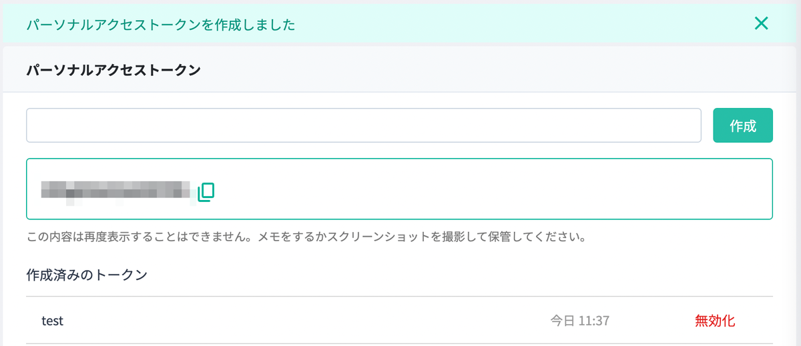
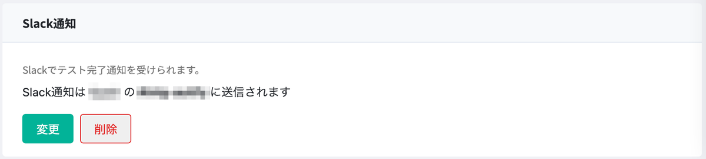

この記事は、 [Kyash Advent Calendar 2022](https://adventar.org/calendars/7407) の8日目の記事です。



　久々のブログ投稿となります。肌寒い日が続きますね。  
今年、2022年11月、Kyashの仲間に加えてもらいました。Software Engineer in Test（SET）という役割で声をかけていただき、ソフトウェアテストに関する自動化を推進するポジションとして、1ヶ月程度、過ごしております。

　私は40歳の大台に差し掛かる今まで、ソフトウェアエンジニアとして主にバックエンドの開発に勤しんできました。もうかれこれ15年程度はこの業界で働いていて、荒波にのまれながらあれやこれや担当していたので、サーバー開発だけでなく、データ基盤やモバイル開、技術責任者なんかも経験してきましたが、私の主戦場はバックエンド（サーバー）開発だと自認しています。    
　そんな中、今回、Software Engineer in Test（SET）という、少し毛色の変わったロールに挑戦しております。過去に脆弱性診断士としてセキュリティ診断を行っていたことや、品質向上のためにテストの自動化に取り組んでいたこと、JSTQB資格の取得などを評価いただいて、現在に至ります。  
　入社してからまだ1ヶ月で、まだまだ成果と言えるような結果を出せているわけではないですが、今回は、今まで取り組んできたこと、これからKyashで、どのようにソフトウェアテストに取り組んでいきたいのかを書きたいと思います。

---

　Kyashは、資金移動業ライセンスを取得しており、お客様の大切なお金に関わるシステムを提供しているFintech企業なので、品質にかけるコストについて重要視しています。入社前に [@konifar](https://x.com/konifar) さんや [@ymzkmct](https://x.com/ymzkmct) さんから、現状のQAについて、予めお話を伺っていたのですが、入社後、QAチームメンバーとコミュニケーションを取らせてもらって、改めて、想像以上にしっかりとテスト活動に取り組んでいるんだなと感じました。  
　Kyashの開発サイクルでは、エンジニアチームが要件定義や実装を進めていく段階で、QAメンバーもテスト計画を立て、開発が終わったらマニュアル（手動）によるテストを実施し、品質の担保を維持しています。Kyashはモバイルアプリ中心のサービスであるため、どうしてもマニュアルテストでなければテスト実施できなかったこともあって、かなりの時間をかけてテストしています。  
　しかし、サービスを開始してから5年程度経過し、多くの機能が実装され、中でもリグレッション（回帰）テストにかかる時間が増えてきたため、リリーススケジュールに影響するようになってきてしまいました。そこで、モバイルアプリのリグレッションテストの自動化を実現するため、様々な可能性を模索している段階です。  

　現在、Webサービスのテストについて、多くのソリューションが提供されており、また、品質を重視する組織が増えてきたこともあり、E2Eやリグレッションテストの自動化率が上がってきているのではないかと思います。また、クラウドベースのインフラ環境を構築している組織も増え、テスト実施の素地を整えやすい環境になってきたことも、ソフトウェアテストの自動化を後押しする要因の1つかなと考えています。  
　しかし、広く普及している便利なソフトウェアサービスは、モバイル端末で操作するものが多く、ブラウザ操作によるテストではなく、アプリ操作によるテストを行わなければならない場面も多いと思います。Kyashはまさに、アプリ操作がメインのサービスであり、自動化がしづらく、テスト工数の肥大化に悩まされています。

　Kyashでは、新しく追加した機能が正しく利用できるかの観点でテストシナリオを設計し、テスト計画に落とし込んでから機能テストを実施しています。その後、プログラムの変更に伴ったシステムへの予想外の影響が起きていないかを確認するために、リグレッションテストを実施しています。Kyashのシステムテストを長く担当してくれているメンバーによる探索的テストも実施しているため、広範囲に渡って不具合への対策が行われています。

　一方で、ソフトウェアテストチームが正しく機能していると感じましたが、開発チームは今どきなスクラムを実践できているのに、テストはウォーターフォールのまま置き去りにされていないかと感じました。ソフトウェアテストが下流工程のようになっていやしないかと。。  
　とはいえ、それはKyashだけではなく、ソフトウェアテストにおいては往々として起こることであり、また、開発とテストのトレードオフ的な関係性を解消できている方が稀だと思います。重厚なテスト活動を行えば、開発期間が短くなるし、テスト活動を軽視すれば品質に問題が出るし・・・とか言うありがちな問題です。

　[@konifar](https://x.com/konifar) さんや [@ymzkmct](https://x.com/ymzkmct) さんとお話したとき、決済事業者としての高い品質を保ったまま、効率的にソフトウェアテストを行うことにより、生産力の爆上げを両立したいと聞いたとき、正直、難しい課題だなと感じました。



　決済事業者として、1円の間違いやミスも許されないドメインを扱っているので、テスト活動を軽視してよいわけがありません。ただ、Kyashは決済システムを0から自社で作ってきたという自負のある会社です。極めて作ることにこだわりがある組織なので、もしかしたら、培ってきた技術力を活かして、生産性の爆上げと高品質を両立できるのではないかと思い、入社を決めました。

---

　テスト活動の自動化において、Kyashでは[Autify for Mobile](https://autify.com/mobile)を利用させていただいています。



　[Autify for Mobile](https://autify.com/mobile) の良いところは、テストコードを書かなくても、モバイルアプリ操作の自動化を実現できる点です。初めてテストプランを作成したとき、ブラウザ操作だけで、エミュレーターが起動し、テストシナリオが作成できたときは、「モバイルアプリのテスト自動化もここまで来たか！」と感動しました。  
　Kyashでは、Pull Requestがマージされたとき、GitHub Actionsでアプリをアップロードし、テストプランを起動するように設定していましたが、度々、テストが失敗するケースがありました。テストが失敗する理由は様々ですが、Pull Requestをベースにテストシナリオを起動していては、シナリオを修正する契機が開発者に依存してしまい、テスターがテストを修正する機会が少なくなり、テストの精度がなかなか上がらないと考えたため、定期的にテストシナリオを起動するようにしました。  
　[Autify for Mobile](https://autify.com/mobile) では、定期実行する機能は提供されていませんが、テストプランを起動するAPIが提供されているので、これを利用して、平日2時間ごとにテストプランを起動するようにしました。

　Autify for Mobileのアカウント設定から、パーソナルアクセストークンを取得します。

[](20221205114250.png)

　今回は、お手軽に定期実行したかったので、Google App Scriptを利用しましたが、以下のPOSTリクエストが実行できればどのような環境でも動きます。

```shell
curl -X 'POST' \
  'https://mobile-app.autify.com/api/v1/test_plans/xxxxx/test_plan_results' \
  -H "Authorization: Bearer 1234567890abc" \
  -H 'accept: application/json' \
  -H 'Content-Type: application/json' \
  -d '{
  "build_id": "xxyyzz"
}'
```

　そして、POSTリクエストに成功したら、以下のようなjsonが戻ってきます。起動したことを通知してほしかったので、SlackのIncomming Webhookにjsonの内容を投稿しています。

```json
{
  "id": "abcdef",
  "test_plan": {
    "id": "xxxxx",
    "name": "Autify Test Plans",
    "created_at": "2022-11-01T01:32:42.999Z",
    "updated_at": "2022-11-05T01:54:18.999Z",
    "build": {
      "id": "xxyyzz",
      "name": "app.build",
      "version": "0.0.1",
      "created_at": "2022-11-29T09:04:56.999Z",
      "updated_at": "2022-11-29T09:04:57.999Z"
    },
    "execute_environments": [
      {
        "os": "iOS",
        "os_version": "14.4",
        "device": "iPhone 12"
      }
    ]
  }
}
```

　起動後、Autify for Mobileのテスト結果ページに実行中のテストプランが表示されます。今まで作ってきたテストプランの実行が終わるのに、だいたい1時間から2時間弱かかっています。  
　Autifyには、テスト実行が終わったらSlackに通知する仕組みもあり、テスト実行が終わったら通知してくれます。

[](20221205123541.png)

　このように、テスト実行回数を増やし、テストシナリオの精度を上げる取り組みを実施しています。

---

　Kyashでは、テスト自動化の取り組みを始めたばかりなので、Autifyのような自動化を始めやすいサービスから導入を進めています。自動テストは壊れやすいため、オートヒーリング機能についても期待しています。  
　しかし、全てをAutifyで自動化できるとは考えておらず、AppiumやSeleniumなどのテスティングフレームワークを使ったテストコードの整備を行い、網羅率とテスト精度を上げていく取り組みを行っていきたいと考えています。

　また、アジャイル開発にテスト活動を組み入れたいと考えており、スプリントの最後にテストをするのではなく、スプリントサイクルにどのようにテストサイクルを組み込んでいくのがチームとしてベストなのか模索していきたいと考えています。

　Kyashは様々なサービスと連携しているため、テスト環境の整備や運用についても、テストエンジニアが率先して取り組んでいく予定です。それは、いついかなるタイミングでテストを実行しても、正しいテスト結果（正誤問わず）を返せる冪等性を担保した環境を整備することにより、開発サイクルを高速化できると考えているからです。いつでもどこでも正しくテストできる事により、Kyash Tech Teamが掲げる3倍界王拳の実現をテストエンジニアから後押ししていきたいと考えています。  

　Webやアプリ開発の様々な技術を駆使して、ソフトウェアテストに取り組み、QuarityをEngineeringしていきたいと考えています。それはもしかしたら、QAエンジニアとか開発エンジニアという枠組みを取っ払い、すべてのKyashのエンジニアがソフトウェアテストの自動化や精度向上に関わる活動を行うマインドセットを持った組織になる未来が訪れることを意味するのかもしれません。

　Kyashでは、ソフトウェアテストの自動化を始め、様々な職種で仲間を募集しています。少しでも興味がございましたら、カジュアル面談でのご連絡もお待ちしております！


